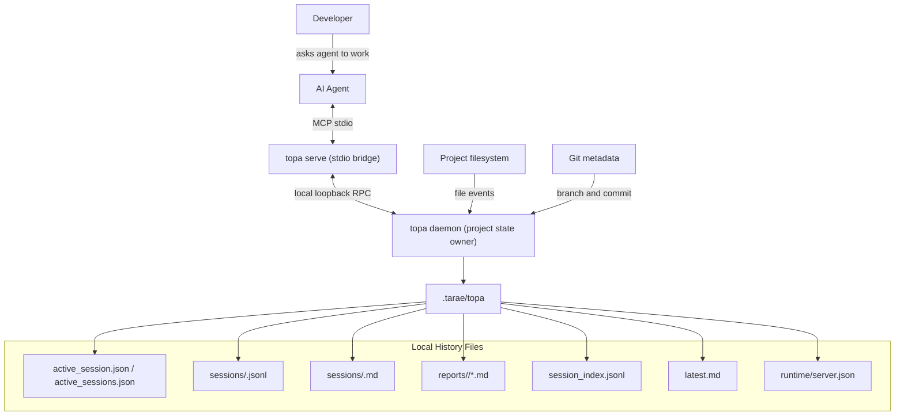

# Architecture

Tarae is a local MCP observer for AI coding sessions. The main runtime is `topa`, a Rust binary that keeps MCP stdio compatibility through a lightweight bridge while one project-scoped daemon records session events, watches local file changes, and stores history inside the project.

The design goal is simple: keep the useful context from AI-assisted development close to the codebase, in formats that both people and AI agents can read.

## System Overview



## Components

- `packages/watcher`: Rust crate that builds `topa`. It hosts the stdio bridge and project daemon, watches file changes, collects git metadata, masks sensitive text, and writes local history.
- `packages/cli`: Node.js CLI for install, link, verify, doctor, status, unlink, and uninstall workflows.
- `packages/tarae-plugin`: agent-facing skill metadata that describes the Tarae lifecycle.
- `docs`: public installation, architecture, and contributor documentation.

## Runtime Flow

1. The user links Tarae to an AI agent with `tarae install --agent <agent> --project-root <path>`.
2. The CLI writes the target agent MCP configuration so it can launch `topa serve`.
3. The AI agent calls Tarae lifecycle tools while it works. Tarae resolves the project root from MCP `roots/list`, from a tool `project_root` argument, or from explicit fixed-root configuration.
4. `topa serve` starts or reuses one project-scoped `topa daemon` through `.tarae/topa/runtime/server.json`.
5. The daemon keeps active sessions by project plus MCP link identity, then appends canonical JSONL events under `.tarae/topa/sessions/`.
6. The daemon regenerates a Markdown projection for the same session and updates `latest.md`.
7. Search tools and the VS Code extension scan `session_index.jsonl` and session JSONL files when an agent asks for prior context.
8. The VS Code extension can render the same local history in a serverless Webview and, when explicitly requested, save generated report Markdown under `reports/`.

## File Layout

```text
.tarae/
└── topa/
    ├── active_session.json
    ├── active_sessions.json
    ├── latest.md
    ├── runtime/
    │   └── server.json
    ├── reports/
    │   └── <session-id>/
    │       └── <timestamp>.md
    ├── session_index.jsonl
    └── sessions/
        ├── <session-id>.jsonl
        └── <session-id>.md
```

- `sessions/<session-id>.jsonl` is the append-only source of truth.
- `sessions/<session-id>.md` is a readable projection with YAML frontmatter and a timeline.
- `latest.md` points people and agents to the most recent rendered session.
- `session_index.jsonl` is a compact search and listing index.
- `active_sessions.json` tracks concurrently open lifecycle sessions by MCP link id. `active_session.json` is kept only for single-session compatibility.
- `runtime/server.json` tracks the local project daemon endpoint, pid, version, heartbeat, and loopback RPC token metadata.
- `reports/<session-id>/*.md` stores optional VS Code-generated session reports. Reports are explicit user outputs and are not canonical event history.

## Event Model

`topa-event-v1` is the canonical local event schema:

```json
{
  "schema_version": "topa-event-v1",
  "event_id": "uuid-v4",
  "event_type": "checkpoint",
  "timestamp": "2026-05-27T00:00:00Z",
  "session_id": "uuid-v4",
  "actor": { "type": "ai_agent", "agent_name": "codex", "link_id": "codex-main" },
  "payload": {
    "summary": "Implemented local history",
    "git_ref": { "branch": "oss", "commit_hash": "abc123" },
    "file_changes": [{ "path": "src/main.rs", "action": "modified", "lines_added": 12 }],
    "attribution": { "status": "explicit", "active_session_count": 1 }
  }
}
```

The JSONL file is append-only. Markdown is regenerated after each event from the JSONL source so it remains easy to read and safe to overwrite.

## Markdown Projection

Markdown session files are optimized for quick reading. They include:

- YAML frontmatter: `session_id`, `objective`, `agent_name`, `link_id`, `status`, timestamps, tags, and project root.
- Timeline entries for lifecycle events.
- Checkpoint and issue summaries.
- Git branch and commit metadata when available.
- Changed file paths, actions, and line counts.
- Short masked log tails for reported issues.

Raw source files, raw diffs, and secrets are outside the Markdown projection.

## MCP Tools

Lifecycle:

- `start_session`
- `checkpoint`
- `report_issue`
- `end_session`

History:

- `fetch_past_context`
- `list_sessions`
- `read_session`
- `search_history`

Search scans `session_index.jsonl` and session JSONL files for objective, summary, error text, log tail, file path, event type, agent name, link id, tags, status, and timestamps. MCP `search_history` exposes those filters directly so agents can retrieve prior work by file, tool, MCP link, session, status, keyword, or date range.

## Process Lifecycle

An MCP client starts `topa serve` as a stdio child process from the configured command, usually:

```text
topa serve
```

`topa serve` is a bridge process. It exits when the MCP stdio connection closes, typically after the AI app or extension host is restarted or closed. The first tool call starts or reuses `topa daemon --project-root <root>`, and that daemon is the only watcher and history writer for the project. It can track multiple active lifecycle sessions concurrently by MCP link identity.

The daemon listens only on loopback with a per-daemon token stored in project-local runtime metadata. Startup is guarded by `.tarae/topa/runtime/server.lock`; stale metadata is ignored when health checks fail, versions differ, or the endpoint no longer responds. Use `topa shutdown --project-root <root>` to stop a project daemon.

## Privacy And Safety Boundary

Tarae records metadata and user-provided summaries. Error text and log tails pass through the local PII filter before being persisted.

Recommended project hygiene:

- Keep `.tarae/` ignored by git unless you intentionally want to publish selected session notes.
- Avoid passing raw secrets, credentials, or proprietary source snippets in MCP tool arguments.
- Treat session history as development context that may contain project paths, summaries, and masked logs.

## Verification Surface

The CLI verification flow checks:

- `topa` binary availability.
- Project root resolution.
- Local history writeability.
- MCP configuration for the selected agent.
- Optional MCP lifecycle smoke test.
- Optional daemon reuse smoke test using a temporary project root.

## Extension Points

Tarae is intentionally small in v1. Useful extension points are:

- Additional MCP clients in `packages/cli/lib/link.js`.
- Richer search over JSONL history.
- Better Markdown projections for team handoff notes.
- Optional packaging channels for platform-specific release binaries.
